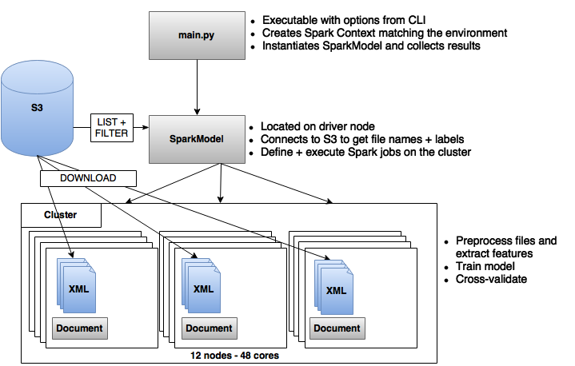
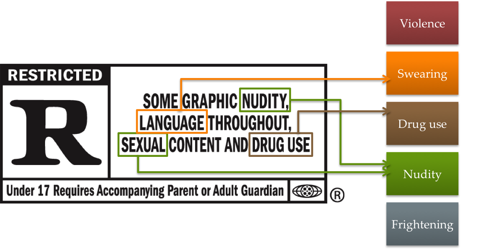
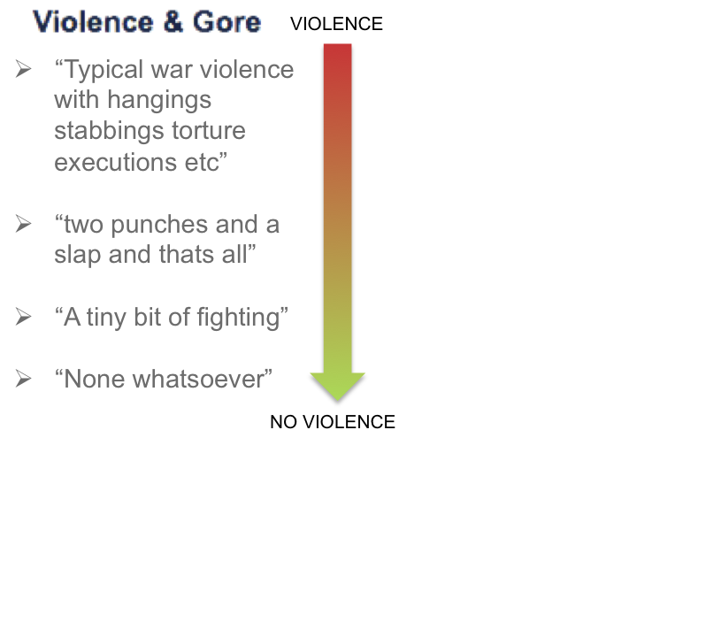
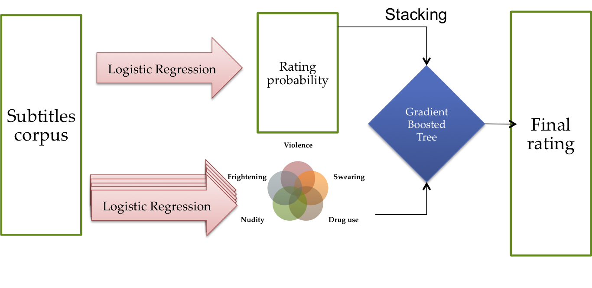

# Parental advisory Machine Learning

## Introduction

This project aims to analyze the large corpus of english subtitles provided by [OpenSubtitles](http://opus.lingfil.uu.se/OpenSubtitles2016.php) and predict what [MPAA rating](http://filmratings.com/what.html) a movie will receive, using NLP techniques to detect elements that would influence the rating, such as scenes of violence or drug use.

The code is written in Python and makes use of the following libraries:

* Processing/modeling pipeline:
    * [Pyspark](http://spark.apache.org/docs/latest/api/python/pyspark.html): Python interface for Spark computing framework
    * [Boto](http://boto.cloudhackers.com/en/latest/): Python interface to AWS S3 file storage facility
    * [NLTK](http://www.nltk.org/): Toolbox for tool processing
    * [Click](http://click.pocoo.org/5/): Command Line Interface customization tool
    * [Pandas](http://pandas.pydata.org/): Python data analysis toolkit   


* Sentiment analysis pipeline:
    * [Scrapy](http://scrapy.org/): Web scraping framework with automated concurrent requests handler
    * [Selenium](http://selenium-python.readthedocs.io/): Web scraping framework for dynamic interactions
    * [Pymongo](https://api.mongodb.com/python/current/): Python interface for MongoDB
    * [Gensim](https://radimrehurek.com/gensim/index.html): NLP framework with [doc2vec](http://arxiv.org/pdf/1405.4053v2.pdf) implementation

The whole project has been done in 2 weeks in the context of Galvanize's data science program. This README details the methodology and reflects the content of this repository.

## TL; DR

Iteration #1: Wrap core architecture around Spark to process the subtitle files and predict the rating.   
Iteration #2: Label the movies as violent, explicit language, explicit content, etc. based on scraped information from IMDB featurized with doc2vec. Build new models to learn these labels.   
Iteration #3: Blend the results of step #1 and #2 to boost predictive power of the final model.   

## Iteration #1: Big data

With a corpus of 100GB of subtitles and some additional scraped information for each subtitle, the first challenge of this project is an obvious one: working in-memory, with a local computer's computing power, is not an option. To deploy my code on several machines and harness the efficiency of distributed computing, I decide to build my pipeline using Spark. Spark learning curve is steep, and debugging it, I realize soon, requires a strong ability to read between the lines of 100s of info logs. Here is an overview of the process.


### Code architecture

When it comes to reading files, Spark has some great functionalities: it can read raw files, folders, JSON, Parquet, zipped files. To achieve this, it iterates over a corpus and breaks all files line-by-line, distributes them over the nodes, letting each node process the assigned set of lines and collecting them back together only once it's required to. But working with a corpus of zipped XML files stored on S3, two problems arise:   

* Reading zip files directly from S3 breaks them down into parts and makes them unreadable;
* Processing XML files requires to infer the structure by matching opening and closing brackets, not necessarily on the same line.

To overcome this, we need to trick Spark into processing our files entirely, and storing these on single nodes. For this purpose, we create a `Document` class structure, that we pass into our Spark context so that the methods and attributes attached to each instance are distributed on all nodes. This lets us encapsulate completely the file processing: after parallelizing the list of keys to our files over all nodes, we can then simply map this key to a document instance, created within the Spark job: This will download our files on each node, and preprocess them as we intend to without breaking down the document in multiple parts.


```python
sc = SparkContext(conf=conf, pyFiles=['document.py'])
rdd = sc.parallelize(zip(s3_keys, labels)).map(lambda (key, label): (key.name, Document(key, label)))
```


With that in mind, I designed my code architecture to be able to distribute most of the calculations, collecting at the same time the primary information on file locations, labels, parameters in instances representing the subtitles.



This enables to easily allocate our code, depending on where we want it to be executed. The two main abstractions are:

#### Document

All the preprocessing work, cleaning, tokenizing, meta-data extraction, belongs here. The document stores as well its key and label for an easy mapping in Spark jobs. Getters are implemented to fetch the bag-of-words or other features of the subtitle file.

#### Spark Model

Any task that must access the whole corpus belongs here, and most of it are distributed as well with Spark jobs. Communication with S3, vocabulary build and TFIDF featurization, and for the next steps `fit`, `predict` and `train` methods. All parameters for training or corpus selection are stored here.

These 2 classes, along with the `main.py` file, can be consulted in the [`code/`](https://github.com/Nathx/parental_advisory_ml/tree/master/code) folder of the repository.

### Pipeline

#### Preprocessing
The preprocessing is, up to the point of vocabulary building, fully embedded in the Document class and ported over all nodes. We go through the following steps for each file:
- Parsing the XML file and returning it in a nested OrderedDict object with the `xmltodict` package;
   - Extracting the sentences from the nested dictionary and retokenizing them into a bag of words;
   - Extracting timestamps and storing in a separate attribute for future use;
   - Extracting metadata (duration, number of tokens, movie genre when attached;
* Removing stopwords by [broadcasting](http://spark.apache.org/docs/latest/programming-guide.html#broadcast-variables) NLTK stopwords corpus over all nodes;
* Stemming our files with nltk;

We then map the results back on the driver node, and redistribute these using Spark's **HashingTF** and **IDF** object to transform our bag of words into feature vectors.

#### Modeling
We then try a few models, using Spark's ML library to maintain a distributed setup. We start by simplifying our classification problem by considering only the R rating, whose features we expect to have a lot less overlap with others, than, for instance PG and PG-13. Out-of-use (GP, M) or under-represented (NC-17) ratings we merge or leave out. This enables us to craft an almost perfectly balanced dataset (52% *R* ratings) of 10k subtitles. We then compare the accuracy of different models with cross-validation.
* Naive Bayes classifier: 68%
* Logistic regression: 70%
* Multi-layer Perceptron Classifier: 75%

Our first implementation of the neural network is promising, clearly outperforming the other models, with one hidden layer of 100 nodes.

# Iteration #2: Underlying patterns

To bring these results one step further, I took some distance on the problem and looked back on the different rating criteria, as communicated by the MPAA and echoed on IMDB. IMDB provides a very good insight into this with the [parental guide](http://www.imdb.com/title/tt2209764/parentalguide) associated to each movie, and 5 dimensions to explain why a movie may be restriced to some audiences, which closely align with the descriptions of the MPAA.



Those seem to be great features to learn, both for as a variable of interest for the interpretation of our classification, and to help our model predict the rating by using the intensity on these 5 different axes as a feature itself.

## Scraping

Code for this section available in the [scraping/](https://github.com/Nathx/parental_advisory_ml/tree/master/scraping) folder.

I therefore decided to dig deeper in this direction, and started collecting information about the movies from 2 different sources:

### MPAA official website

Using *selenium* to simulate clicks on the [official website](http://www.filmratings.com/search.html?filmYear=2015&filmRating=PG) of the MPAA, I scraped all descriptions of movie in the above format. I then used TF-IDF to identify the most relevant keywords from the description (e.g., 'violent', 'drugs', 'sexual content', etc.) and flagged the 5 dimensions accordingly to these descriptions.

### IMDB website

I then used *scrapy* to download the parental guide section for all the movies present in the OpenSubtitles corpus. This parental guide is divided in 5 sections (as visible [here](http://www.imdb.com/title/tt2333804/parentalguide)) filled with eventual comments and descriptions with respect to this dimension. The presence of content in a specific section, though, was not sufficient to flag a dimension as positive, as many comments were only stating the lack of sensitive content with respect to this dimension.



## Sentiment analysis

With about 70% of our corpus properly flagged on the 5 dimensions thanks to the MPAA's description, this was actually a great setup for a sentiment analysis task. Using the scraped content from MPAA's website as the target, I trained a doc2vec model on the comments from IMDB, and then used a logistic regression to predict the sentiment associated with a specific dimension.   

Doc2vec is an extension of word2vec which has been first introduced in a [paper](http://arxiv.org/pdf/1405.4053v2.pdf) by Quoc Le and Thomas Mikolov in 2014, and soon after implemented in Python's great module [gensim](http://radimrehurek.com/gensim/models/doc2vec.html) by Radim Rehurek. It starts with the same learning approaches as word2vec, CBOW and Skip-gram, yet extend them further to learn and featurize not only the words of a document but also the document itself.

Here we have an interesting dataset to apply this model, as the content related to each section is very descriptive and concise content. The vocabularies of each section are very distinct, there is therefore no advantage in training all of them together: we train 5 different models, one for each section, and try to learn the sentiment (positive/negative) associated with each comment. We compare the different techniques and find that the Skip-gram approach performs here significantly better, with an overall accuracy rate of 77%.

Once the model fine-tuned, a new model is trained with the same parameters on the whole labeled corpus, and used to predict the sentiment of the whole unlabeled corpus, i.e. the movies having comments on IMDB but no precise description from the MPAA.

## Learning from subtitles

With this expanded 5-fold new labels for a relatively large corpus (34k movies), we are ready to train on our subtitles and see how learning these new patterns increases our accuracy.

Spark's implementation of neural networks doesn't allow to get the probability at each of the output nodes but instead gives back directly the winner of the softmax layer. Instead, we therefore train 5 logistic regressions in parallel, and the results are extremely positive: with cross-validation the accuracy is overall of 90.4% and the precision of 89.4%. The models with the highest FP rate are SCARY and DRUGS, while NUDITY has the lowest TP rate, as we would expect since this is probably the hardest feature to detect from text. The overall results are nonetheless very promising.

# Iteration #3: Blending results

The last step of this project has been to merge back our results together. Here is what the final pipeline looks like:


## Blending

To turn the prediction of our models from #1 and #2 into features, we go through the following steps:
- Trains the pipeline on (n-1) folds of the train dataset.
- Predicts n-th fold.
- Predicts holdout set.   

Repeat n times, then:
- Concatenate predictions made on each fold to reconstruct prediction for the whole train set.
- Average predictions (probabilities) on the holdout set to get a final prediction.
- Concatenates both to reconstruct the feature for the whole RDD.

Thanks to this blending of our predictions, we are able to both:
* Get the best probability of each pattern (and of the R rating) without overfitting
* Average the prediction of 5 n different models on the unlabeled dataset, making it more robust to overfitting as well and possibly slightly more accurate, following the same rationale as bootstrapping.

Here again the non-separable softmax layer of Spark's neural network implementation stops us from using it. The code for this section is available [here](https://github.com/Nathx/parental_advisory_ml/blob/master/code/feature_blending.py).

## Final results

A Gradient Boosted Tree Classifier is finally used to train on the blended results of the first layer of models. After cross-validation, the final accuracy is 80.1%, a 14% increase on the rating prediction in the first layer alone. Success!

# Conclusion

This project has been a great occasion to dive in deeper into Spark, doc2vec, NLP methodology and approach. The scope of this project has been limited to be achievable in the available time, but a couple directions could yet be explored:   

* Implementing neural nets with another library to allow all patterns to be learned together instead of separately
* Extend the prediction to different types of rating systems, and compare the influence of the different patterns on the ratings
* Deploy a live app connected to the OpenSubtitles API to get prediction on newly created subtitles.

That being said, the results achieved here are already exciting, and if you have interest in this project and would like to collaborate to bring this model further or turn into a live app, feel free to shoot me a message, I’d be happy to dive back into it.
